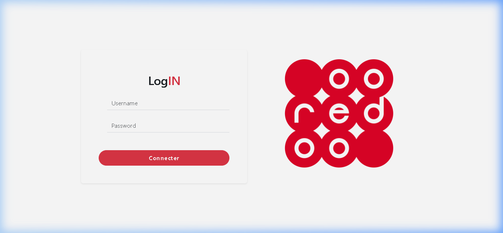
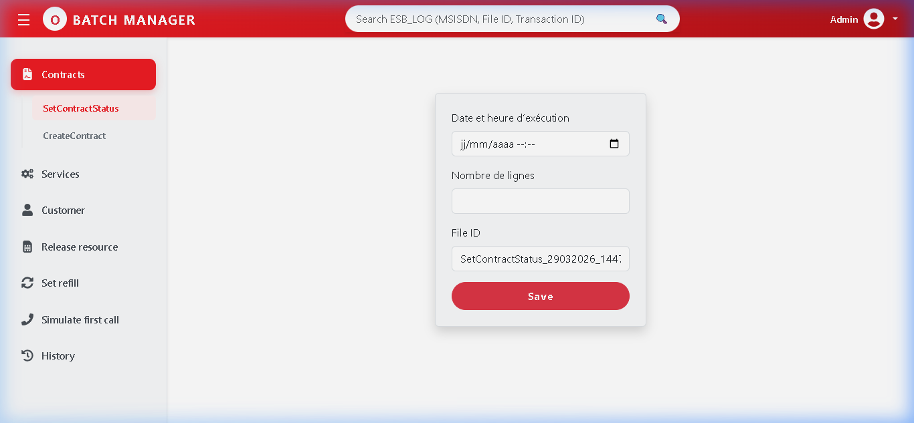
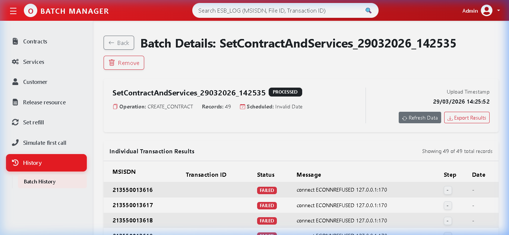
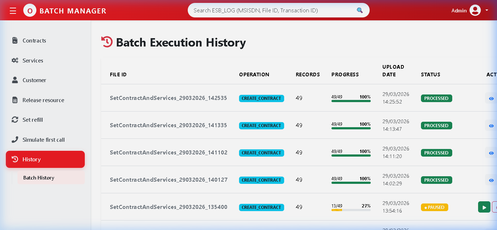
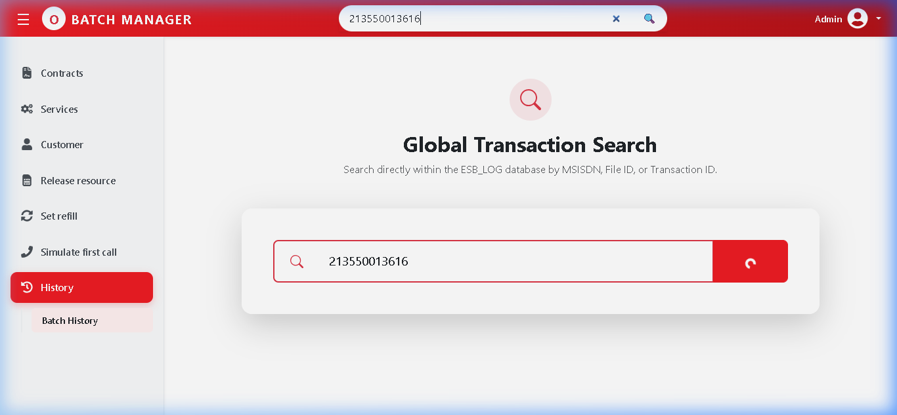

<!-- _class: center -->

  
  

# Batch App Presentation

## Enterprise Service Bus (ESB) Hub

### **Designed and implemented by Brahamia Oualid**
### Professional Bulk Transaction Management

---

## 🏗️ Technical Architecture Details

The system follows a modern service-oriented architecture (SOA).

### **🎨 Frontend Implementation**
- **React 18 & Vite**: Fast HMR.
- **PrimeReact & Bootstrap**: UI.
- **Context API**: Global State.
- **React-Router**: Secure Routing.

### **⚙️ Backend Infrastructure**
- **Node.js & Express**: API layer.
- **Oracle Database**: Persistent Audit.
- **Node-Cron**: Background Throttling.
- **Axios**: SOAP/REST Client.

---

## 🚀 Active Module: Create Batch ✅

Automated subscriber onboarding with high-volume handling capacity.

- **File Engine**: Supports **.xlsx** and **.csv** bulk file injection.
- **Input logic**: Automatic MSISDN range validation and normalization.
- **ESB Trigger**: Asynchronous requests to ESB WebServices.
- **Audit**: Every transaction is logged with its unique Trace-ID.

---

## 🚀 Active Module: Set Contract Status ✅

Bulk management of subscriber lifecycles (Active, Suspend, etc.)

- **State Sync**: Real-time synchronization with HLR/HSS.
- **Flow Control**: **Pause/Resume/Cancel** functionality for job safety.
- **Throttling**: Background workers execute tasks without blocking UI.
- **Persistency**: Batch data stored securely in Oracle for auditing.

---

## 🔐 1. System Access & Security Gateway

Features JWT-based authentication for verified operator access.

---

## 📥 2. Automated Lot Import console

Dynamic console for file upload and real-time operational status.

---

## 📊 3. Full Transactional Audit logs

Granular monitoring of each MSISDN with detailed error code descriptions.

---

## 📜 4. Global Search & Audit History

Full historical traceability of thousands of transactions via Oracle DB logs.

  
  

---

## ✨ System Key Highlights

- **Efficiency**: Reduces manual labor by an estimated 95% for bulk tasks.
- **Security**: JWT tokens ensure all batches are attributed to a user.
- **Reliability**: Persistence layer ensures zero data loss on ESB errors.
- **Diagnostics**: Map specific ESB errors (e.g., 500, 404) to user-friendly tips.

### **DESIGNED AND IMPLEMENTED BY BRAHAMIA OUALID**
